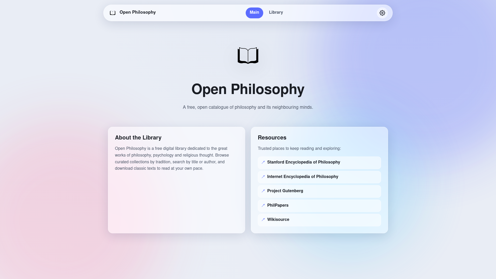
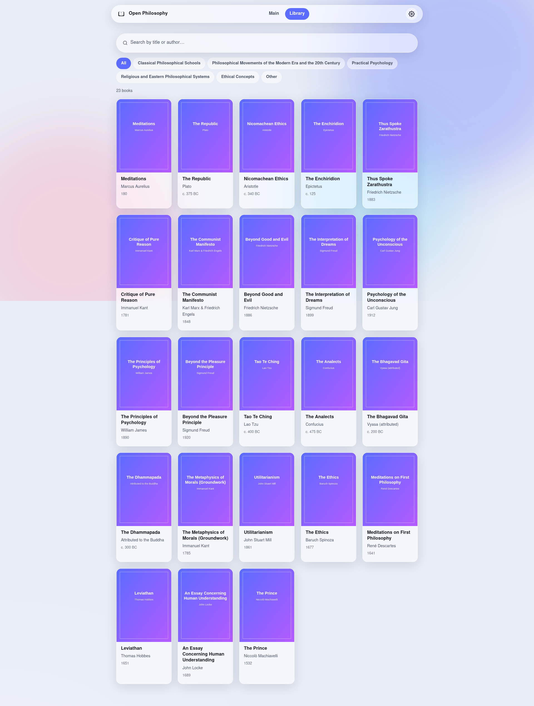
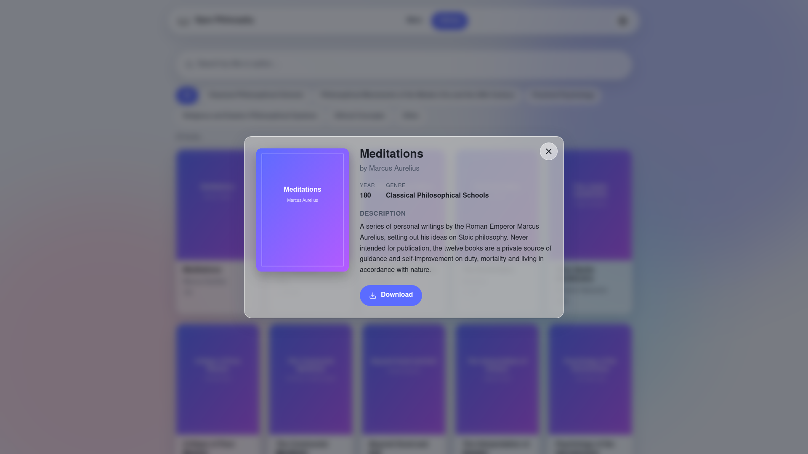
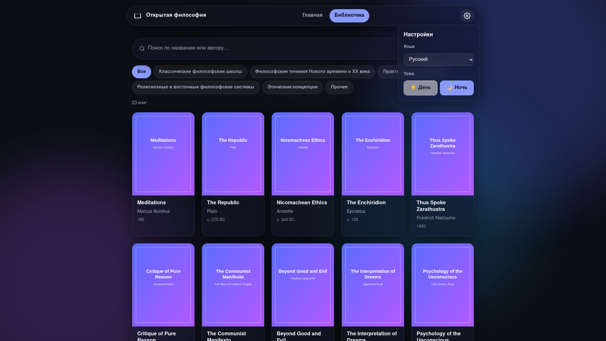
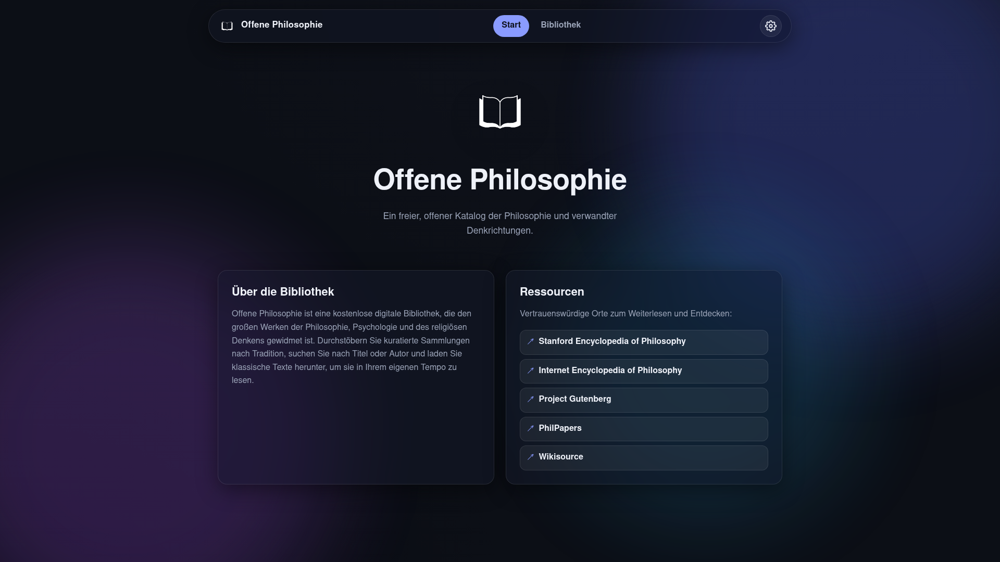

# Open Philosophy

A free, open digital library of philosophy and its neighbouring fields, built
with the standard web stack — plain **HTML, CSS and JavaScript**, no build step
and no backend.



## Features

- **Floating, glassy navbar** with two tabs — **Main** and **Library** — plus a
  settings button.
- **Main page** styled around the logo, with a tile describing the library and a
  tile of curated resource links.
- **Library** with a book catalogue populated from a JavaScript array. Each book
  record carries a description, title, cover image, author, publication year and
  a download link.
  - The catalogue cards show **only** the cover, title, date and author.
  - Opening a book reveals a modal with the full **description, download link,
    cover, title, date and author**.
  - **Search by title and author** filters the catalogue live.
  - **Genre sub-tabs** act as separate pages within the Library:
    - Classical Philosophical Schools
    - Philosophical Movements of the Modern Era and the 20th Century
    - Practical Psychology
    - Religious and Eastern Philosophical Systems
    - Ethical Concepts
    - Other
- **Settings**:
  - **Language switcher** — English (default), Russian, German and Chinese. The
    whole interface is translated.
  - **Theme switcher** — day and night. The night theme uses the white logo
    (`logo_op_white`) and the day theme uses the black logo (`logo_op_black`).
- **Modern design** — blurred glass surfaces and animated background blobs.
- The browser tab shows only the library name (**Open Philosophy**) and the
  avatar (favicon).
- Preferences (language and theme) persist between visits via `localStorage`.

## Running

Because the app is fully static, open `src/index.html` directly, or serve the
`src/` folder:

```bash
cd src
python3 -m http.server 8099
# then visit http://localhost:8099/
```

## Project structure

```
src/
├── index.html         # markup and layout
├── css/styles.css     # theme variables, glassmorphism, responsive layout
├── js/
│   ├── books.js       # the book catalogue (JSON array) + genre keys
│   ├── i18n.js        # translations (en/ru/de/zh) + resource links
│   └── app.js         # routing, search, modal, language & theme switching
└── logo/              # brand logos (black/white variants + favicon)
```

## Screenshots

| Library (day) | Book modal |
| --- | --- |
|  |  |

| Library (night, Russian) | Main (night, German) |
| --- | --- |
|  |  |

## Notes on data

Cover images link to Wikimedia Commons and download links point mostly to
Project Gutenberg. If a remote cover cannot be loaded, a graceful generated
placeholder (a gradient card with the title and author) is shown instead, so the
catalogue always renders.
